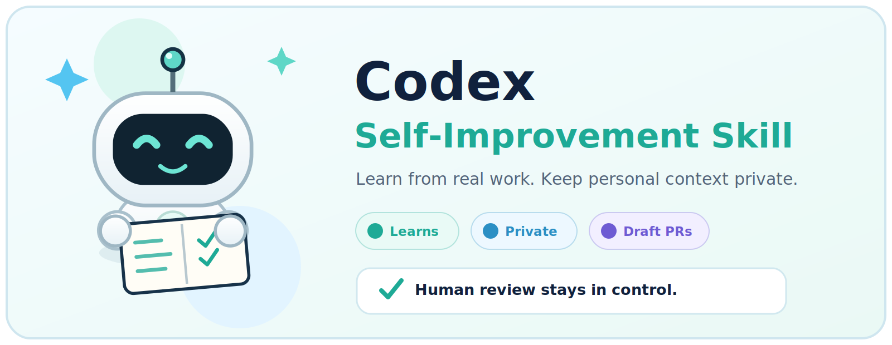
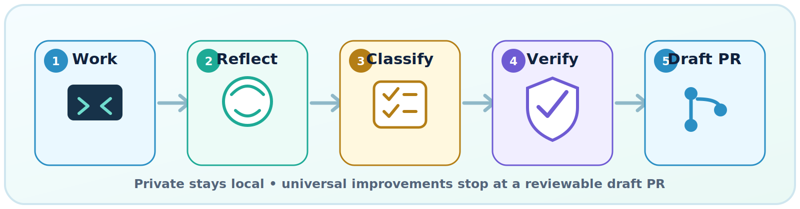
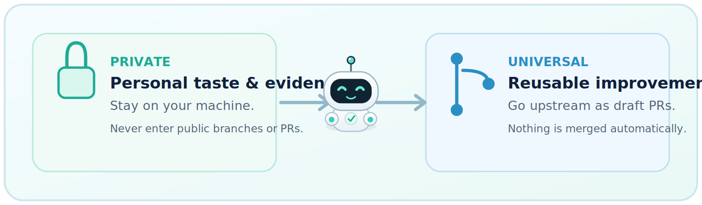
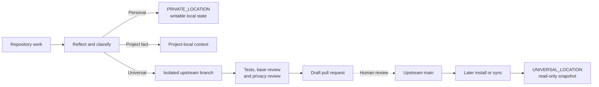

<p align="center">
  
</p>

<h1 align="center">Codex Self-Improvement Skill</h1>

<p align="center"><strong>A self-improving Codex skill that learns from real work—without leaking what makes your setup personal.</strong></p>

<p align="center">
  
  
  
  
</p>

It gives Codex a durable learning loop for engineering judgment, corrections, workflow efficiency, and private user taste. Personal context stays local. Reusable improvements can travel upstream—but only through reviewable draft pull requests.

## Quick install

### macOS / Linux

```bash
curl -fsSL https://raw.githubusercontent.com/DH-stream/Codex-Self-Improvement-Skill/main/install.sh | bash
```

### Windows PowerShell

```powershell
irm https://raw.githubusercontent.com/DH-stream/Codex-Self-Improvement-Skill/main/install.ps1 | iex
```

> **Your personal preferences stay local. Universal improvements are proposed as draft PRs. Nothing is merged automatically.**

The one-liners require Git. They create or refresh a persistent checkout under the Codex state directory, validate the repository layout, and then run the bundled staged installer. A bootstrap failure leaves the active installation untouched.

## Why this exists

Capable coding agents still lose useful context between tasks. Corrections can disappear into chat history, project-specific facts can get mistaken for universal rules, and “being efficient” can quietly become “skipping verification.”

This skill adds a small, explicit learning system:

| | |
|---|---|
| **🧠 Learns from evidence**<br>Durable corrections and successful patterns improve future work. | **🔒 Private by design**<br>Personal taste, private evidence, and local history never enter public branches. |
| **🌍 Shares carefully**<br>Qualified reusable improvements become isolated, verified draft PRs. | **🧭 Human-controlled**<br>No direct push to `main`, automatic approval, ready transition, or merge. |
| **⚡ Efficient by default**<br>One primary agent works inline; subagents are reserved for useful parallelism or specialist risk. | **🧪 Quality firewall**<br>TDD, review, privacy, safety, and final verification are never traded for token savings. |

<p align="center">
  
</p>

## How it works

<p align="center">
  
</p>

1. **Work** — Codex completes normal repository work.
2. **Reflect** — explicit feedback is evaluated; technical efficiency reflection runs only after technical changes.
3. **Classify** — evidence becomes private learning, a project-local fact, a universal improvement, or no write.
4. **Verify** — relevant tests, complete-file review, base comparison, and privacy checks run.
5. **Draft PR** — a qualified universal improvement may open or update one isolated draft PR for human review.

No meaningful learning means no write and no self-improvement narration. A real write produces one compact filename/PR notice.

## Private vs universal learning

<p align="center">
  
</p>

| Private local state | Public universal state |
|---|---|
| Personal UX, design, color, copy, and interaction preferences | Reusable engineering patterns and preventive checks |
| Private evidence, history, and blocked-upstream queue | Skill engine, schemas, pressure scenarios, and neutral templates |
| Writable under `PRIVATE_LOCATION` | Authored only in an isolated upstream branch/worktree |
| Preserved across reinstall and refresh | Installed later as a read-only snapshot under `UNIVERSAL_LOCATION` |

Project facts stay project-local. They are context—not global learning.

## Safety and control

- The installed universal snapshot is read-only.
- Universal changes start from current remote `main` in an isolated branch/worktree.
- Stable contribution IDs and deterministic branches prevent duplicate retries.
- Network or authentication failures are preserved in local `UPSTREAM_QUEUE.md`.
- Retries reuse existing branch/PR state and run at most once per session or natural consolidation point.
- Private memory is excluded from public commits, issues, branches, and pull requests.
- Codex never pushes directly to `main`, merges, approves, or marks its own update ready for review.

## Architecture



```text
CORE.md                              Stable system invariants
AGENTS.md                            Repository routing and safety rules
skills/codex-self-improvement/       Installable skill and references
memory/*.md                          Public universal seed state
memory/private-template/             Neutral templates for private local state
install/AGENTS-snippet.md            Global activation hook
install.sh / install.ps1             Local + streamed staged installers
tests/test-install.*                 Installer regression coverage
tests/pressure-scenarios.md          Behavioral pressure scenarios
docs/superpowers/                    Approved designs and implementation plans
```

## Installation details

### Inspect and run from a clone

macOS / Linux:

```bash
git clone https://github.com/DH-stream/Codex-Self-Improvement-Skill.git
cd Codex-Self-Improvement-Skill
./install.sh
```

Windows PowerShell:

```powershell
git clone https://github.com/DH-stream/Codex-Self-Improvement-Skill.git
cd Codex-Self-Improvement-Skill
.\install.ps1
```

### Paths and overrides

Default state lives under `~/.codex/self-improvement/` (or the Windows equivalent beneath the user profile).

| Setting | Purpose |
|---|---|
| `CODEX_HOME` / `-CodexHome` | Override the Codex home directory. |
| `UPSTREAM_LOCATION` / `-UpstreamCheckout` | Use an existing validated checkout. |
| `UPSTREAM_REPOSITORY` / `-UpstreamRepository` | Override the upstream Git repository. |

Legacy `SELF_IMPROVEMENT_UPSTREAM_CHECKOUT` and `SELF_IMPROVEMENT_UPSTREAM_REPOSITORY` aliases remain accepted.

The installers validate required sources before activation, stage complete replacements, preserve private memory and the upstream queue, refresh the universal snapshot, and maintain exactly one marked activation block in global `AGENTS.md`.

## Verification status

Run the executable shell suite with:

```bash
bash -n install.sh
bash tests/test-install.sh
```

The current suite covers nine shell behaviors, including streamed fresh install, failed-bootstrap preservation, managed-checkout refresh, private-state preservation, complete universal replacement, malformed activation markers, repository retargeting, and Python-free installation.

A matching PowerShell streamed-install regression runner is included at `tests/test-install.ps1`. It still requires execution in a real PowerShell environment before that path is considered runtime-proven.

Remaining external gates:

- fresh-agent pressure scenarios with and without the skill;
- authenticated GitHub end-to-end branch discovery, push, partial-failure retry, and draft-PR creation;
- Windows PowerShell execution of the PowerShell installer regression suite.

See [`tests/verification-report.md`](tests/verification-report.md) for the evidence and limitations.

## Start exploring

- Read the stable invariants in [`CORE.md`](CORE.md).
- Open the installed workflow in [`SKILL.md`](skills/codex-self-improvement/SKILL.md).
- Inspect universal patterns in [`memory/ACTIVE_PATTERNS.md`](memory/ACTIVE_PATTERNS.md).
- Review the behavioral gates in [`tests/pressure-scenarios.md`](tests/pressure-scenarios.md).
- Report a problem or propose an improvement through this repository's issues and pull requests.

<p align="center"><strong>Learn locally. Improve deliberately. Share safely.</strong></p>
