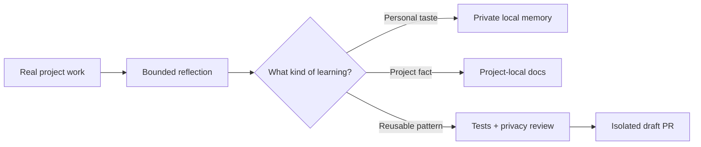

# Friendly README and Brand Kit Implementation Plan

> **For agentic workers:** REQUIRED SUB-SKILL: Use superpowers:subagent-driven-development (recommended) or superpowers:executing-plans to implement this plan task-by-task. Steps use checkbox (`- [ ]`) syntax for tracking.

**Goal:** Replace the plain README with a friendly, product-style GitHub landing page and a reusable four-image brand kit.

**Architecture:** The README remains standard GitHub Markdown. Four repository-local images establish the mint/sky-blue learning-bot identity; fenced code blocks provide copy buttons; Mermaid and text preserve accessibility and technical clarity. Installation claims are added only after the streamed-installer plan passes.

**Tech Stack:** GitHub Markdown, repository-relative PNG assets, Mermaid, image generation, existing repository documentation.

## Global Constraints

- English copy throughout.
- Friendly open-source tone, not dark enterprise or cyberpunk styling.
- Use mint green, sky blue, white space, rounded cards, and a small learning bot.
- No essential information may exist only inside an image.
- The two one-line install commands must be separate fenced code blocks.
- Do not advertise streamed installation until its tests pass.
- Do not claim a license or show a license badge without a `LICENSE` file.
- Disclose remaining Windows and authenticated GitHub end-to-end verification gates.

---

## File map

- `assets/brand/hero.png` — wide README banner.
- `assets/brand/bot-mark.png` — transparent square mascot mark.
- `assets/brand/privacy-memory.png` — local-private versus universal-public learning visual.
- `assets/brand/workflow.png` — Work → Reflect → Classify → Verify → Draft PR visual.
- `README.md` — landing-page copy, install flow, architecture, verification, and contribution guidance.

### Task 1: Generate and inspect the brand assets

**Files:**
- Create: `assets/brand/hero.png`
- Create: `assets/brand/bot-mark.png`
- Create: `assets/brand/privacy-memory.png`
- Create: `assets/brand/workflow.png`

**Interfaces:**
- Produces: repository-relative PNGs referenced by `README.md`.

- [ ] **Step 1: Generate the hero**

Use image generation with this exact art direction:

```text
A wide 3:1 GitHub README hero illustration for an open-source developer tool. Bright white background with mint green and sky-blue accents. A small friendly learning robot with a rounded white body, blue face screen, tiny antenna, and a mint notebook stands near the center-left. Around it float clean rounded cards suggesting memory, a shield, a Git branch, a checkmark, and a draft pull request. Modern vector-like SaaS illustration, warm and approachable, polished but not childish, generous whitespace, soft shadows, crisp edges. No readable text, no logos, no code snippets, no photorealism, no cyberpunk, no dark background.
```

Export at approximately `1800×600` as `assets/brand/hero.png`.

- [ ] **Step 2: Generate the bot mark**

```text
A transparent square mascot icon for an open-source developer tool: the same friendly learning robot, rounded white body, sky-blue face screen, tiny antenna, holding a mint notebook with one subtle Git-branch symbol. Clean vector-like illustration, centered, simple silhouette, polished, warm, no words, no logos, no background scene.
```

Export at `1024×1024` with transparent background as `assets/brand/bot-mark.png`.

- [ ] **Step 3: Generate the privacy visual**

```text
A wide friendly vector-style illustration explaining two kinds of AI learning. Left side: a small learning robot beside a closed mint notebook and a home/local-device symbol protected by a soft shield. Right side: the same robot beside a clean sky-blue Git branch and a draft pull-request card. A clear visual divider connects them without mixing their contents. Bright white background, mint and sky-blue palette, rounded cards, soft shadows, no readable text, no logos, no people, no dark or cyberpunk styling.
```

Export at approximately `1600×800` as `assets/brand/privacy-memory.png`.

- [ ] **Step 4: Generate the workflow visual**

```text
A horizontal five-stage friendly vector illustration for a developer workflow: work, reflect, classify, verify, and draft pull request. Use five connected rounded visual stations with a small learning robot moving through them: code window, notebook and sparkle, two organized memory cards, shield with checkmark, then a Git draft pull-request card. Bright white background, mint green and sky blue, soft shadows, clean open-source documentation style, no readable text, no logos, no dark background.
```

Export at approximately `1800×700` as `assets/brand/workflow.png`.

- [ ] **Step 5: Inspect every output**

Check at full size and at roughly 360px README width for:

- unwanted or malformed text;
- accidental third-party logos;
- inconsistent robot design;
- cropped antennae, cards, or shadows;
- muddy contrast on GitHub light and dark page chrome;
- personal/user-specific content in pixels or metadata.

Regenerate any asset that fails. Keep each file reasonably compressed without visible artifacts.

- [ ] **Step 6: Commit the assets**

```bash
git add assets/brand
git commit -m "design: add friendly learning bot brand kit"
```

### Task 2: Write the landing-page README

**Files:**
- Modify: `README.md`

**Interfaces:**
- Consumes: `assets/brand/*.png`, verified installer commands, `CORE.md`, `skills/codex-self-improvement/SKILL.md`, `tests/verification-report.md`.
- Produces: the public repository landing page.

- [ ] **Step 1: Replace the hero and pitch**

Start `README.md` with:

```markdown
<p align="center">
  
</p>

<h1 align="center">Codex Self-Improvement Skill</h1>

<p align="center">
  <strong>A self-improving Codex skill that learns from real work—without leaking what makes your setup personal.</strong>
</p>

<p align="center">
  Turn corrections into better future behavior, keep personal preferences local, and propose reusable improvements through reviewable draft PRs.
</p>

<p align="center">
  <a href="#quick-install">Quick Install</a> ·
  <a href="#how-it-works">How It Works</a> ·
  <a href="#private-vs-universal-learning">Privacy Model</a> ·
  <a href="#safety-and-control">Safety</a>
</p>
```

Use only badges whose current state can be proven from repository files. Omit badges entirely rather than guessing.

- [ ] **Step 2: Add Quick Install immediately below the hero**

```markdown
## Quick Install

### macOS / Linux

```bash
curl -fsSL https://raw.githubusercontent.com/DH-stream/Codex-Self-Improvement-Skill/main/install.sh | bash
```

### Windows PowerShell

```powershell
irm https://raw.githubusercontent.com/DH-stream/Codex-Self-Improvement-Skill/main/install.ps1 | iex
```

> The one-liner downloads a persistent Git checkout and runs the bundled staged installer. Your personal preferences stay local. Universal improvements are proposed as draft PRs. Nothing is merged automatically.
```

Add a one-sentence fallback link to the advanced clone-based install section.

- [ ] **Step 3: Add the problem and feature overview**

Write a concise `Why this exists` section that explains:

- agents can repeat corrected behavior;
- user taste, project facts, and reusable engineering lessons are different kinds of knowledge;
- this skill classifies and stores each kind in the correct place.

Follow it with a mobile-readable two-column HTML table containing these five benefit cards:

- Learns from explicit corrections.
- Keeps personal taste local.
- Keeps project facts project-local.
- Opens public-safe universal changes as draft PRs.
- Preserves testing, review, and verification gates.

Each cell must remain understandable without an icon image.

- [ ] **Step 4: Add How it works**

Reference the workflow asset:

```markdown
<p align="center">
  
</p>
```

Then explain the five stages in five short numbered paragraphs. State that reflection remains silent when nothing durable is written.

- [ ] **Step 5: Add Private vs universal learning**

Reference `privacy-memory.png`, then provide this comparison structure:

```markdown
| Private and local | Universal and reviewable |
| --- | --- |
| UX and visual taste | Reusable engineering patterns |
| Personal corrections and evidence | Public-safe recurring mistakes |
| Private history and retry queue | Skill procedures and pressure tests |
| Never committed to GitHub | Proposed through an isolated draft PR |
```

Add one explicit sentence: project-specific facts remain in the project and are not promoted as universal memory.

- [ ] **Step 6: Add Safety and control**

Use a compact checklist that states:

- no direct push to `main`;
- no automatic merge or approval;
- no automatic ready-for-review transition;
- stable contribution IDs prevent duplicate retry branches;
- private evidence is removed before public diff review;
- quality checks are never traded for token savings.

- [ ] **Step 7: Add architecture and repository map**

Include a Mermaid flowchart showing:



Retain a concise repository tree for `CORE.md`, `skills/`, `memory/`, `install/`, `tests/`, and `docs/superpowers/`.

- [ ] **Step 8: Add advanced installation**

Preserve the current clone-based commands and document:

- `UPSTREAM_LOCATION`;
- `UPSTREAM_REPOSITORY`;
- legacy aliases;
- persistent checkout location;
- private and universal storage locations;
- reinstall behavior and private-state preservation.

Add a pinned-ref alternative that downloads a reviewed tag or commit only after such a tag/commit is explicitly substituted by the reader; do not invent a release version.

- [ ] **Step 9: Add verification and contribution status**

Accurately state the number of shell tests observed after implementation. Keep the existing disclosure that PowerShell execution, fresh-agent pressure scenarios, and authenticated branch/PR creation may remain external gates unless evidence has changed.

Link to:

- `CORE.md`;
- `skills/codex-self-improvement/SKILL.md`;
- `tests/pressure-scenarios.md`;
- `tests/verification-report.md`.

Invite issues and draft PRs. Do not add a license badge or licensed-use claim.

- [ ] **Step 10: Commit the README**

```bash
git add README.md
git commit -m "docs: launch friendly product README"
```

### Task 3: Verify the complete README experience

**Files:**
- Review: `README.md`
- Review: `assets/brand/*`
- Review: installer and test changes from the bootstrap plan.

- [ ] **Step 1: Verify relative files and anchors**

```bash
for file in hero.png bot-mark.png privacy-memory.png workflow.png; do
  test -f "assets/brand/$file" || exit 1
done

grep -Fq 'id="' README.md && echo "Review custom IDs manually" || true
grep -Fq 'curl -fsSL https://raw.githubusercontent.com/DH-stream/Codex-Self-Improvement-Skill/main/install.sh | bash' README.md
grep -Fq 'irm https://raw.githubusercontent.com/DH-stream/Codex-Self-Improvement-Skill/main/install.ps1 | iex' README.md
```

Expected: all asset and command checks pass.

- [ ] **Step 2: Re-run installation verification**

```bash
bash -n install.sh
bash tests/test-install.sh
```

Run `tests/test-install.ps1` wherever PowerShell is available.

- [ ] **Step 3: Review copy against implementation**

Check every statement about storage, retries, draft PRs, verification, and installer behavior against the actual code and current `main`, not only the design spec.

- [ ] **Step 4: Inspect the complete diff against `main`**

```bash
git diff --check main...HEAD
git diff --stat main...HEAD
git diff main...HEAD -- README.md install.sh install.ps1 tests
```

Manually inspect all four images and confirm no private content or unwanted text is present.

- [ ] **Step 5: Commit review fixes**

```bash
git add README.md assets/brand install.sh install.ps1 tests
git commit -m "fix: polish README launch and verification"
```

- [ ] **Step 6: Prepare a draft PR**

The PR body must separate:

- README and visual identity changes;
- Bash and PowerShell streamed bootstrap behavior;
- tests actually executed;
- external gates not executed;
- screenshots or direct links to the rendered README where available.

Leave the PR as a draft for human review.
